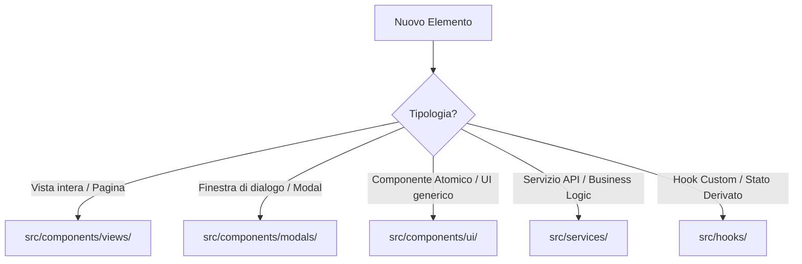

# 🗺️ Piano di Evoluzione & Manutenzione Continua - Kinefit

Questo documento stabilisce le linee guida architetturali, i pattern e le strategie per supportare l'evoluzione continua del progetto **Kinefit (appPalestra)** in modo ordinato, robusto e scalabile.

---

## 🛠️ 1. Linee Guida Architetturali per Nuove Funzionalità

Dato che il progetto è in continua evoluzione, è fondamentale preservare l'ordine architetturale stabilito per evitare che il codebase torni a essere "piatto" o destrutturato.

### A. Posizionamento e Organizzazione dei File

Ogni nuovo elemento deve essere inserito rigorosamente nelle cartelle dedicate in base alla sua responsabilità:



### B. Gestione del Barrel File (`src/components/index.ts`)

Ogni volta che si crea un nuovo componente in `/auth`, `/modals`, `/ui` o `/views`:

1. **Esportazione Named:** Prediligere sempre le esportazioni named (`export const MioComponente = ...`) rispetto al default export, poiché facilitano il refactoring e l'auto-completamento dell'IDE.
2. **Aggiornamento dell'Index:** Registrare immediatamente il nuovo componente all'interno di `src/components/index.ts` per rendere l'import pulito dall'esterno:
   ```typescript
   export * from './ui/NuovoComponente';
   ```

### C. Co-location dei Test

- Ogni nuovo servizio, hook custom o componente di UI complesso **deve** avere il proprio file di test posizionato nella stessa cartella, con estensione `.test.ts` o `.test.tsx`.
- _Esempio:_ `src/components/ui/NuovoComponente.tsx` -> `src/components/ui/NuovoComponente.test.tsx`.

### D. Decomposizione e Refactoring di Componenti Complessi (Case Study)

Per garantire la manutenibilità, i componenti di presentazione non devono contenere logica complessa di calcolo o fetching di dati.

- **Caso di Studio 1 (Implementato):** Il componente `AnalyticsView.tsx` era originariamente di circa 30KB e conteneva calcoli di e1RM storici, delta peso e ordinamenti cronologici complessi.
- **Soluzione:** Tutta la logica di business e gli stati sono stati estratti nell'hook custom dedicato `src/hooks/useAnalytics.ts`.
- **Risultato:** `AnalyticsView.tsx` è ora un componente puro dedicato al rendering visivo (PieChart, AreaChart, LineChart), facilitando enormemente la manutenzione e l'estensione futura dei grafici senza rischiare di alterare i calcoli di business sottostanti.
- **Caso di Studio 2 (Implementato):** Il modale `LogExerciseModal.tsx` era lungo 595 righe e gestiva calcoli per l'E1RM dell'esercizio, l'effetto coriandoli celebrativo (confetti), il timer di recupero, il caricamento asincrono di record personali, dello storico e dei log offline tramite IndexedDB.
- **Soluzione:** Tutta la logica, lo stato reattivo e le interazioni con i servizi sono state incapsulate nell'hook custom `src/hooks/useLogExercise.ts`.
- **Risultato:** Il file `LogExerciseModal.tsx` ha ridotto la sua complessità logica a zero, concentrandosi unicamente sul rendering grafico della UI (guida dell'esercizio, form di input e calcolatore dischi `BarbellVisualizer`).

---

## 💾 2. Evoluzione dello Stato e dei Dati

### A. TanStack React Query (Stato Asincrono/Server)

- **Standardizzazione delle Richieste:** Qualsiasi interazione con il database Supabase (fetch di dati, inserimenti, aggiornamenti, cancellazioni) deve passare esclusivamente attraverso React Query (`useQuery` e `useMutation`).
- **Invalidazione della Cache:** Inserire policy di invalidazione chiare ed esplicite nei gestori di mutazione. Ad esempio, dopo il salvataggio di un log:
  ```typescript
  queryClient.invalidateQueries({ queryKey: ['logs', 'today'] });
  ```

### B. Zustand (Stato Locale/Sincrono)

- **Stato Minimale:** Lo store Zustand (`src/store/useStore.ts`) deve contenere solo stati di interfaccia sincroni globali o indicatori di stato del dispositivo (es. visibilità di modali globali, conteggio coda offline, sessione attiva corrente).
- **Persistenza Selettiva:** Utilizzare sempre la proprietà `partialize` del middleware `persist` per evitare di salvare nel localStorage dati volatili o che potrebbero andare fuori sincrono con il server.

---

## 🛜 3. Strategia Offline & Robustezza della Sincronizzazione

La sincronizzazione offline tramite **IndexedDB** è uno dei cuori pulsanti dell'applicazione. Con l'evoluzione del progetto, questo modulo richiede attenzioni specifiche.

### A. Migrazioni del Database IndexedDB

Se le funzionalità future richiederanno modifiche alla struttura dei dati salvati localmente:

1. Incrementare la costante `DB_VERSION` in `src/lib/indexedDb.ts`.
2. Gestire l'evento `onupgradeneeded` verificando le versioni precedenti per evitare la perdita dei dati non sincronizzati dell'utente:
   ```typescript
   if (event.oldVersion < 3) {
     // Esegui upgrade dello store offline
   }
   ```

### B. Strategia di Gestione Conflitti e Retry

- **Retry Esponenziale:** Attualmente il sistema esegue un polling ogni 5 secondi. In caso di connessioni estremamente degradate (es. seminterrati di palestre), valutare l'implementazione di un algoritmo di **Exponential Backoff** per evitare di saturare le risorse del browser.
- **Detezione Conflitti (SQL 23505 / 23503):** Proseguire con la politica di rimozione controllata dei log orfani o duplicati dalla coda locale per evitare il blocco permanente della sincronizzazione di altri elementi validi.

---

## 🧪 4. Strategia di Test & Prevenzione delle Regressioni

Per consentire modifiche rapide e sicure all'app, la suite di test deve evolvere di pari passo con il codice.

```
┌────────────────────────────────────────────────────────┐
│             STRATEGIA DI TESTING SUGGERITA             │
├────────────────────────────────────────────────────────┤
│  1. Unit Test (Vitest)                                 │
│     Copertura minima 80% su Hooks e Servizi core       │
├────────────────────────────────────────────────────────┤
│  2. Integration Test (Testing Library)                │
│     Verifica dei flussi di interazione nei Modali      │
├────────────────────────────────────────────────────────┤
│  3. E2E Test (Playwright / Cypress) - FUTURO           │
│     Simulazione del flusso completo di allenamento     │
└────────────────────────────────────────────────────────┘
```

### A. Test E2E (End-to-End)

È raccomandata l'introduzione di test E2E per simulare scenari reali come:

- Inizio dell'allenamento offline -> Inserimento di 3 set -> Ripristino della rete (mock) -> Verifica della sincronizzazione automatica su Supabase -> Fine dell'allenamento.

---

## 🗄️ 5. Gestione del Database e Migrazioni (Supabase)

Attualmente il progetto fa uso di script una tantum (es. `SUPABASE_MIGRATION_SCRIPT.gs` o file `.sql` manuali). Per un progetto in costante evoluzione, si consiglia la transizione a un workflow strutturato.

### A. Configurazione della Supabase CLI (Implementato)

Il progetto è stato configurato per adottare la CLI ufficiale di Supabase per gestire lo schema tramite migrazioni versionate:

1. La struttura delle migrazioni è stata inizializzata nella cartella `supabase/migrations/`.
2. È stata creata la migrazione iniziale `supabase/migrations/20260528000000_init.sql` contenente la creazione di tutte le tabelle core (`exercises`, `workout_sessions`, `training_logs`, `biometrics`, `user_settings`), le relazioni di chiavi esterne e i vincoli di cancellazione a cascata.
3. Per applicare modifiche future, è sufficiente creare una nuova migrazione con `supabase migration new nome_modifica` e applicarla in produzione in modo deterministico e tracciato su Git.

### B. Row Level Security (RLS) Rigorosa

Tutte le tabelle devono avere la RLS abilitata per proteggere l'integrità dei dati personali degli utenti. Le policy devono essere sempre verificate ad ogni aggiunta di colonne o relazioni:

```sql
alter table public.training_logs enable row level security;

create policy "Gli utenti possono gestire solo i propri log"
  on public.training_logs for all
  using (auth.uid() = user_id);
```

---

## 🚀 6. Automazione CI/CD Consigliata

Per supportare l'integrazione e il rilascio continuo senza interruzioni di servizio:

1.  **Pipeline di Validazione (GitHub Actions):**
    - Configurare un workflow che si attiva ad ogni Pull Request o Push sul branch principale (`main`/`master`).
    - La pipeline deve eseguire in ordine:
      1.  `npm ci` (installazione pulita delle dipendenze).
      2.  `npm run typecheck` (controllo formale dei tipi).
      3.  `npm run lint` (verifica aderenza stilistica).
      4.  `npm run test` (esecuzione di tutti i test unitari e di integrazione).
2.  **Rilascio Vincolato:**
    - Consentire il deployment su Vercel (o altra piattaforma di hosting) solo se la pipeline di validazione ha completato tutti gli step con successo.
