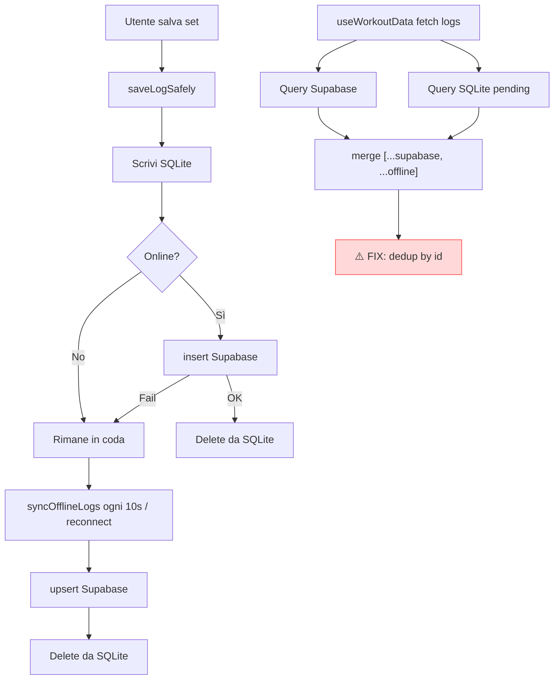

# KineFit — Audit Completo, Bug e Piano di Miglioramento

> **Data analisi:** 13 luglio 2026  
> **Scope:** intera codebase (`mobile/`, `supabase/`, tooling root, documentazione)  
> **Prodotto attivo:** app mobile Expo/React Native (SDK 54) — **non esiste più la PWA web**

---

## Sommario esecutivo

KineFit è un tracker palestra offline-first ben strutturato a livello di layering (Views → Hooks → Services → SQLite/Supabase). Il flusso core — login, scheda giornaliera, log set, timer recupero, storico, analytics — **funziona**, ma presenta:

- **8 bug funzionali** con impatto reale sull'utente (Android, persistenza dati, duplicati)
- **Debito legacy significativo** dalla migrazione web → mobile (docs, config, codice morto)
- **Zero test automatizzati** nonostante CI e documentazione che li prescrivono
- **Feature DB/UI incomplete** (onboarding, Garmin, impostazioni, peso corporeo)
- **Gap di sicurezza operativa** (chiavi Supabase hardcoded, log in produzione)

**Verdetto:** MVP mobile solido, non ancora production-grade. Con 2–3 sprint mirati si raggiunge un livello affidabile per uso quotidiano.

---

## 1. Architettura attuale

```
┌─────────────────────────────────────────────────────────┐
│  Expo App (React Native 0.81 + React 19)                │
│  ├── Views: Oggi | Storico | Analisi | Profilo | Auth   │
│  ├── Hooks: useWorkoutData, useLogExercise, useAuth     │
│  ├── State: Zustand (sessione, timer) + TanStack Query  │
│  ├── Services: exercise, log, session, profile          │
│  └── Offline: SQLite (expo-sqlite) + syncOfflineLogs    │
└──────────────────────────┬──────────────────────────────┘
                           │ PostgREST + Auth
┌──────────────────────────▼──────────────────────────────┐
│  Supabase (PostgreSQL + RLS)                            │
│  exercises | workout_sessions | training_logs           │
│  biometrics | user_settings                             │
└─────────────────────────────────────────────────────────┘
```

| Area                | Stato          | Note                                           |
| ------------------- | -------------- | ---------------------------------------------- |
| Auth email/password | ✅ Funzionante | Solo login, no registrazione/recupero password |
| Scheda giornaliera  | ✅ Funzionante | Selettore 7 giorni, progresso set              |
| Log esercizi        | ✅ Funzionante | PR, fast-log, cedimento auto, Compex           |
| Offline sync        | ⚠️ Parziale    | Buona base, rischio duplicati e edge case      |
| Timer recupero      | ⚠️ Parziale    | Funziona ma non rispetta impostazioni utente   |
| Profilo/Settings    | ❌ Incompleto  | Dati non persistiti                            |
| Analytics           | ⚠️ Parziale    | Ignora log offline, formula e1RM inconsistente |
| Test                | ❌ Assenti     | Solo typecheck in CI                           |
| Documentazione      | ❌ Obsoleta    | README ancora descrive PWA Vite                |

---

## 2. Bug — catalogo completo

### 🔴 Critici (bloccanti o perdita dati)

#### BUG-01 — `Alert.prompt` su Android (crash/silenzioso)

**File:** `mobile/src/components/views/ProfileView.tsx:44-61`

`Alert.prompt` è un'API **solo iOS**. Su Android la modifica del peso corporeo non funziona (o può causare errori runtime).

**Fix:** Sostituire con `Modal` + `TextInput` cross-platform, oppure libreria `react-native-prompt-android`.

---

#### BUG-02 — Peso corporeo non salvato su Supabase

**File:** `ProfileView.tsx:52-54`

`updateWeight()` aggiorna solo `useState` locale. `profileService.saveWeight()` esiste ma **non viene mai chiamato**. Il peso si perde al riavvio dell'app.

**Fix:**

```typescript
// In updateWeight onPress:
await profileService.saveWeight(user!.id, parseFloat(val));
setBodyWeight(val);
```

Caricare il peso all'avvio da `profileService.fetchWeightHistory()` (ultimo record).

---

#### BUG-03 — Impostazioni non persistite

**File:** `mobile/src/components/modals/SettingsModal.tsx`

Tutti gli switch (`haptics`, `timerAutoStart`, `notifications`) usano `useState` locale. Non leggono né scrivono:

- `profileService.saveSettings()` → Supabase `user_settings`
- Zustand persistito → AsyncStorage

**Impatto:** L'utente configura il timer automatico ma al riaprire il modal tutto torna ai default. Il timer parte sempre dopo ogni set indipendentemente dalla preferenza.

**Fix:** Collegare `SettingsModal` a `userSettings` da `useWorkoutData` / query dedicata; persistere su Supabase e/o AsyncStorage per preferenze locali (haptics).

---

#### BUG-04 — Mapping errato `timer_secs` ↔ `recovery_timer`

**File:** `mobile/src/services/profileService.ts:36-40`

`fetchUserSettings()` fa cast diretto del row DB (`timer_secs`) su `UserSettings` (`recovery_timer`). Il campo risulta sempre `undefined` in app.

**Fix:** Mappare esplicitamente:

```typescript
return {
  recovery_timer: data.timer_secs,
  bar_weight: data.bar_weight,
  // ...altri campi
};
```

---

#### BUG-05 — Possibili log duplicati (merge Supabase + SQLite)

**File:** `mobile/src/hooks/useWorkoutData.ts:89`, `useLogExercise.ts:80`

I log vengono uniti con:

```typescript
return [...(data || []), ...targetOffline];
```

Senza deduplicazione per `id`. Durante la finestra di sync (upsert su Supabase + delete da SQLite) o in caso di race condition, lo stesso set può apparire **due volte**, gonfiando volume e conteggio set.

**Fix:** Deduplicare per `id` (o `tempId`):

```typescript
const merged = [...(data || []), ...targetOffline];
const byId = new Map(merged.map((l) => [l.id ?? l.tempId, l]));
return Array.from(byId.values());
```

---

#### BUG-06 — `endWorkoutSafely` crea sessione fantasma

**File:** `mobile/src/lib/offlineSync.ts:118-128`

Se la sessione non esiste in SQLite locale, viene creata con `start_time: endTime` (stesso valore di `end_time`). Questo corrompe la durata e lo storico sessioni.

**Fix:** Recuperare `start_time` da Supabase se assente in locale, oppure non creare la sessione offline se non esiste già.

---

#### BUG-07 — Init SQLite fallita → app continua senza offline

**File:** `mobile/App.tsx:93-98`

Se `initDb()` fallisce, `setDbReady(true)` viene comunque chiamato. L'utente entra nell'app senza storage locale; i log offline non vengono salvati silenziosamente.

**Fix:** Mostrare schermata errore con retry, o almeno banner persistente "Modalità solo online".

---

### 🟠 Alti (funzionalità degradata)

#### BUG-08 — PR count sempre 0 nel riepilogo workout

**File:** `mobile/src/hooks/useWorkoutData.ts:167`

```typescript
prsCount: 0,  // hardcoded
```

Il modal `WorkoutSummaryModal` non mostra i record personali raggiunti durante la sessione.

**Fix:** Tracciare PR durante la sessione in Zustand, o ricalcolarli confrontando log della sessione con storico.

---

#### BUG-09 — Primo record personale non rilevato

**File:** `mobile/src/hooks/useLogExercise.ts:171-174`

```typescript
const isPR = personalRecord && (weightVal > personalRecord.weight || ...);
```

Se `personalRecord` è `null` (nessun log precedente), il primo set **non viene mai celebrato** come PR.

**Fix:** `const isPR = !personalRecord || weightVal > personalRecord.weight || ...`

---

#### BUG-10 — Analytics ignora log offline

**File:** `mobile/src/components/views/AnalyticsView.tsx:31-34`

`fetchWeeklyVolumeByMuscle()` interroga solo Supabase. Allenamenti offline non sincronizzati (o in coda) non compaiono in heatmap e grafico volume.

**Fix:** Unire log SQLite degli ultimi 7 giorni prima del calcolo, come già fatto in `useWorkoutData`.

---

#### BUG-11 — Volume target hardcoded a 3500 kg

**File:** `mobile/src/hooks/useWorkoutData.ts:187`

```typescript
const volumeProgressVal = Math.min((totalVolume / 3500) * 100, 100);
```

Non personalizzato per utente, giorno o scheda. Un giorno gambe vs petto ha target molto diversi.

**Fix:** Calcolare target da `sum(ex.target_sets * stima_peso)` o da `user_settings`.

---

#### BUG-12 — Formula e1RM inconsistente

**File:** `mobile/src/lib/utils.ts:14-17` vs `LogExerciseModal.tsx:90`

- `utils.ts`: formula Brzycki `w / (1.0278 - 0.0278 * r)`
- `LogExerciseModal`: formula Epley `w * (1 + r/30)`

Risultati diversi per lo stesso input. `calculateE1RM` in utils non è usata nel modal.

**Fix:** Centralizzare una sola formula (Brzycki è standard in powerlifting) e usarla ovunque.

---

#### BUG-13 — `fetchPersonalRecord` ordina solo per peso

**File:** `mobile/src/services/logService.ts:50-58`

Ordina `weight DESC, reps DESC` ma Supabase applica un solo `.order()`. Un record di 100kg×5 può perdere contro 100kg×3 se l'ordinamento multiplo non funziona come atteso.

**Fix:** Calcolare e1RM lato client o usare RPC Postgres `ORDER BY weight * reps DESC` / formula e1RM.

---

#### BUG-14 — Auth senza validazione input

**File:** `mobile/src/components/views/AuthView.tsx:20-24`

Nessun controllo su email vuota/password corta. Usa `alert()` nativo invece di `Alert.alert` — inconsistente su Android.

---

#### BUG-15 — Pulsante info in OggiView non fa nulla

**File:** `mobile/src/components/views/OggiView.tsx:107-109`

`TouchableOpacity` senza `onPress` handler.

---

#### BUG-16 — Menu Notifiche apre Impostazioni

**File:** `ProfileView.tsx:98-101`

Voce "Notifiche" chiama `setShowSettings(true)` — stesso comportamento di "Impostazioni".

---

#### BUG-17 — Typo setter in SettingsModal

**File:** `SettingsModal.tsx:22,60`

`setTimerAutoAutoStart` (doppio "Auto") — naming confuso, indizio di refactoring incompleto.

---

### 🟡 Medi (qualità / edge case)

#### BUG-18 — `getDateForSelectedDay` non gestisce giorni futuri

**File:** `mobile/src/lib/utils.ts:46-62`

Se `diff < 0`, aggiunge 7 giorni (settimana scorsa). Non esiste modo di loggare per un giorno **futuro** della settimana corrente (es. mercoledì quando oggi è lunedì).

---

#### BUG-19 — Query key `logs` senza `userId`

**File:** `useWorkoutData.ts:75`

`queryKey: ['logs', currentDay]` — potenziale stale cache se si cambia account sullo stesso device (raro ma possibile).

---

#### BUG-20 — `syncOfflineLogs` senza retry/backoff

**File:** `offlineSync.ts:17-68`

Errori di rete vengono ignorati silenziosamente. Nessun exponential backoff, nessun log utente sulla coda pendente (`offlineQueueCount` esiste in store ma **non è mostrato in UI**).

---

#### BUG-21 — `saveLogSafely` usa `insert` invece di `upsert`

**File:** `offlineSync.ts:156`

Il sync usa `upsert`, il save immediato usa `insert`. Un retry dopo timeout di rete può causare errore `23505` (duplicate key) senza gestione.

**Fix:** Usare `upsert` anche nel path online immediato.

---

#### BUG-22 — Sessioni offline non visibili in Storico

**File:** `HistoryView.tsx` → `sessionService.fetchSessionsWithStats()`

Solo Supabase. Sessioni create offline non ancora sincronizzate non appaiono in cronologia.

---

#### BUG-23 — `AddExerciseModal` non aggiorna `selectedDay` al cambio `defaultDay`

**File:** `AddExerciseModal.tsx:40`

`useState(defaultDay)` non reagisce se `defaultDay` cambia mentre il modal è chiuso.

**Fix:** `useEffect(() => setSelectedDay(defaultDay), [defaultDay])`.

---

#### BUG-24 — `keyExtractor` con index in SessionDetailsModal

**File:** `SessionDetailsModal.tsx:73`

`keyExtractor={(_, index) => index.toString()}` — anti-pattern React, può causare re-render errati.

---

#### BUG-25 — UUID client-side con `Math.random()`

**File:** `offlineSync.ts:7-13`

Non critico per uso personale, ma `crypto.randomUUID()` (già polyfilled in `App.tsx` via `react-native-get-random-values`) è più sicuro e standard.

---

### 🟢 Bassi (cosmetici / manutenzione)

| ID     | Problema                                                                     | File                        |
| ------ | ---------------------------------------------------------------------------- | --------------------------- |
| BUG-26 | `getMuscleColor()` usa CSS `var(--color-*)` — inutile in RN                  | `utils.ts:1-12`             |
| BUG-27 | `calculatePlates()` duplicata in `PlateCalculator.tsx`                       | `utils.ts:22-36`            |
| BUG-28 | `PlaceholderView` mai importata                                              | `views/PlaceholderView.tsx` |
| BUG-29 | `console.log` Supabase URL ad ogni avvio                                     | `supabase.ts:34`            |
| BUG-30 | Versione hardcoded "v1.0.0" in SettingsModal                                 | `SettingsModal.tsx:89`      |
| BUG-31 | `sessionService.startWorkout/endWorkout` duplicano `offlineSync` (dead code) | `sessionService.ts:54-67`   |

---

## 3. Sicurezza

| ID     | Rischio                                                   | Severità | Azione                                                                         |
| ------ | --------------------------------------------------------- | -------- | ------------------------------------------------------------------------------ |
| SEC-01 | Supabase anon key hardcoded in `app.json` e `supabase.ts` | Media    | Spostare in EAS Secrets / `EXPO_PUBLIC_*` env; ruotare chiave se repo pubblico |
| SEC-02 | RLS corretto su tutte le tabelle                          | ✅ OK    | Verificare periodicamente con test integration                                 |
| SEC-03 | Nessun rate limiting lato client su login                 | Bassa    | Gestito da Supabase Auth                                                       |
| SEC-04 | Log sensibili in produzione (`console.log` URL)           | Bassa    | Rimuovere o wrappare con `__DEV__`                                             |
| SEC-05 | Nessuna validazione peso/reps bounds                      | Bassa    | Limitare input (es. peso 0–500, reps 1–100)                                    |

> **Nota:** La anon key Supabase è progettata per essere pubblica se RLS è attivo. Il rischio principale è abuso API, non esposizione dati utente.

---

## 4. Debito tecnico e legacy

### Documentazione obsoleta (da aggiornare o archiviare)

| File                        | Problema                                                       |
| --------------------------- | -------------------------------------------------------------- |
| `README.md`                 | Descrive React+Vite+PWA+IndexedDB+Recharts — **non esiste**    |
| `GEMINI.md`                 | Riferimenti a `/src` web                                       |
| `.env.example`              | Variabili `VITE_SUPABASE_*`                                    |
| `playwright.config.ts`      | Punta a `localhost:5173` e cartella `e2e/` inesistente         |
| `tsconfig.json` (root)      | Referenzia `tsconfig.app.json` / `tsconfig.node.json` mancanti |
| `eslint.config.js`          | `reactRefresh.configs.vite` senza Vite                         |
| `mobile/TODO_COMPLETION.md` | Feature già implementate segnate come mancanti                 |
| `mobile/MOBILE_ROADMAP.md`  | "100% complete" — non accurato                                 |
| `CHANGELOG.md`              | Riferimenti a test e2e web non più presenti                    |

### Codice morto da rimuovere

- `getMuscleColor()`, `calculatePlates()` in `utils.ts` (se non usati)
- `PlaceholderView.tsx`
- `sessionService.startWorkout` / `endWorkout` (sostituiti da `offlineSync`)
- `database/supabase_rls_policies.sql` (duplica migration)

### Script orfani

- `scripts/extract_data.py` → richiede `database/scheda palestra.xlsx` **assente dal repo**
- `scripts/download-exercises.js` → verificare se ancora necessario

---

## 5. Feature incomplete (DB pronto, UI assente)

La migration `20260530000000_add_user_profile.sql` aggiunge colonne mai usate in mobile:

| Campo DB                                 | Stato UI                                                           |
| ---------------------------------------- | ------------------------------------------------------------------ |
| `height`, `birth_year`, `biological_sex` | ❌ Nessun onboarding                                               |
| `experience_level`, `primary_goal`       | ❌                                                                 |
| `training_days_per_week`                 | ❌                                                                 |
| `injuries_notes`, `gym_equipment`        | ❌                                                                 |
| `garmin_connected`                       | ✅ Demo locale + OAuth2 PKCE via edge `garmin` (secrets richiesti) |
| `onboarding_completed`                   | ❌ Nessun flusso first-run                                         |
| `bar_weight` in settings                 | ❌ Non configurabile (hardcoded 20kg in PlateCalculator?)          |

### Audio timer

**File:** `soundService.ts:26` — `expo-audio` importato ma non implementato. Il timer termina solo con haptic, non con suono/notifica push (anche se toggle notifiche esiste).

---

## 6. Miglioramenti UX/UI

### Priorità alta

1. **Indicatore coda offline** — Mostrare badge quando `offlineQueueCount > 0` ("3 set in attesa di sync")
2. **Banner sessione recuperata** — `OggiView` logga in console ma non mostra UI per sessione ripresa
3. **Feedback errori auth** — Sostituire `alert()` con UI coerente (toast/banner rosso)
4. **Refresh profilo reale** — `ProfileView.onRefresh` è un `setTimeout` finto
5. **Swipe-to-delete** su set nella lista (oltre al trash icon)
6. **Conferma fine workout** — Evitare tap accidentale su "TERMINA"

### Priorità media

7. **Reorder esercizi** — `order_index` esiste in DB, nessuna UI drag-and-drop
8. **Modifica/eliminazione esercizi** dalla scheda
9. **Warmup set** — `set_type: 'W'` supportato in DB, non selezionabile in UI
10. **Dark/light theme** — Solo dark hardcoded
11. **Localizzazione** — UI italiana hardcoded, nessun i18n
12. **Accessibilità** — Mancano `accessibilityLabel` su pulsanti critici

### Priorità bassa

13. Animazioni transizione tab/modal
14. Widget home screen (volume settimanale)
15. Export CSV storico allenamenti
16. Condividi riepilogo workout (immagine/social)

---

## 7. Miglioramenti architettura e codice

### 7.1 Testing (gap critico)

**Stato attuale:** `docs/TESTING_GUIDELINES.md` descrive piramide Vitest + Playwright. **Zero file test.**

**Piano minimo vitale:**

```
mobile/
├── __tests__/
│   ├── lib/
│   │   ├── utils.test.ts          # getDateForSelectedDay, calculateE1RM
│   │   └── offlineSync.test.ts    # merge, dedup, sync logic
│   ├── hooks/
│   │   └── useLogExercise.test.ts # PR detection, auto-failure
│   └── services/
│       └── profileService.test.ts # mapping timer_secs
```

**CI:** Aggiungere `npm run mobile:test` con Vitest + `@testing-library/react-native`.

**E2E mobile:** Maestro o Detox per flusso login → log set → verifica storico.

### 7.2 Error boundary globale

Nessun `ErrorBoundary` React. Un crash in una view può far chiudere l'intera app senza recovery.

### 7.3 QueryClient configurazione

```typescript
// App.tsx — attuale: new QueryClient() senza opzioni
const queryClient = new QueryClient({
  defaultOptions: {
    queries: {
      staleTime: 30_000,
      retry: 2,
      refetchOnWindowFocus: true,
    },
  },
});
```

### 7.4 Separare preferenze locali vs cloud

| Preferenza       | Dove salvare                                       |
| ---------------- | -------------------------------------------------- |
| Haptics on/off   | AsyncStorage (locale, immediato)                   |
| Timer auto-start | Supabase `user_settings.timer_secs` + flag boolean |
| Notifiche push   | Expo Notifications + Supabase                      |
| Bar weight       | Supabase `user_settings.bar_weight`                |

### 7.5 Environment management

```
mobile/
├── .env.example          # EXPO_PUBLIC_SUPABASE_URL, EXPO_PUBLIC_SUPABASE_ANON_KEY
├── app.config.ts         # Sostituire app.json statico, leggere da env
```

Rimuovere fallback hardcoded da `supabase.ts`.

---

## 8. Database — miglioramenti schema

### Indici mancanti (performance)

```sql
CREATE INDEX idx_training_logs_user_created ON training_logs(user_id, created_at DESC);
CREATE INDEX idx_training_logs_exercise ON training_logs(exercise_id, created_at DESC);
CREATE INDEX idx_workout_sessions_user_start ON workout_sessions(user_id, start_time DESC);
CREATE INDEX idx_exercises_user_day ON exercises(user_id, training_day);
```

### Vincoli utili

```sql
ALTER TABLE training_logs ADD CONSTRAINT chk_weight_positive CHECK (weight >= 0);
ALTER TABLE training_logs ADD CONSTRAINT chk_reps_positive CHECK (reps > 0);
ALTER TABLE training_logs ADD CONSTRAINT chk_rpe_range CHECK (rpe BETWEEN 1 AND 10);
ALTER TABLE training_logs ADD CONSTRAINT chk_set_type CHECK (set_type IN ('W','S','F'));
```

### RPC consigliate

- `get_personal_record(exercise_id)` — calcolo e1RM-based
- `get_weekly_volume(user_id, days)` — aggregazione server-side per analytics
- `get_session_summary(session_id)` — volume, durata, PR count

### Seed migration user-specific

`20260609000000_nuova_scheda_giancarlo.sql` contiene dati per un utente specifico. Per produzione multi-utente: spostare in script seed opzionale, non in migration automatica.

---

## 9. DevOps e CI/CD

### CI attuale (`.github/workflows/ci.yml`)

✅ format:check, lint, mobile:typecheck  
❌ test, build EAS, Supabase migration check

### Miglioramenti CI

```yaml
# Aggiunte consigliate
- name: Run Mobile Tests
  run: npm run mobile:test

- name: Supabase Migration Lint
  run: npx supabase db lint # se CLI disponibile

- name: Depcheck
  run: npm run depcheck
```

### Release

- Allineare versione root (`2.1.0`) vs mobile (`1.0.0`) vs `app.json`
- EAS build automatico su tag `v*`
- `build-apk.bat` funziona solo Windows — documentare equivalente bash

---

## 10. Roadmap implementativa

### Fase 0 — Hotfix urgenti (1–2 giorni)

| #   | Task                                      | Bug ref |
| --- | ----------------------------------------- | ------- |
| 0.1 | Fix `Alert.prompt` → Modal cross-platform | BUG-01  |
| 0.2 | Persistenza peso corporeo                 | BUG-02  |
| 0.3 | Deduplicazione log merge                  | BUG-05  |
| 0.4 | Fix mapping `timer_secs`                  | BUG-04  |
| 0.5 | PR detection primo record                 | BUG-09  |
| 0.6 | Rimuovere `console.log` produzione        | BUG-29  |

### Fase 1 — Affidabilità core (1 settimana)

| #   | Task                                         | Bug ref |
| --- | -------------------------------------------- | ------- |
| 1.1 | Persistenza SettingsModal                    | BUG-03  |
| 1.2 | Collegare timer auto-start alle impostazioni | BUG-03  |
| 1.3 | Fix `endWorkoutSafely` sessione fantasma     | BUG-06  |
| 1.4 | `upsert` in `saveLogSafely`                  | BUG-21  |
| 1.5 | UI indicatore coda offline                   | BUG-20  |
| 1.6 | Gestione errore init SQLite                  | BUG-07  |
| 1.7 | Analytics include log offline                | BUG-10  |
| 1.8 | Calcolo PR count nel summary                 | BUG-08  |

### Fase 2 — Qualità e test (1 settimana)

| #   | Task                                            |
| --- | ----------------------------------------------- |
| 2.1 | Setup Vitest in `mobile/`                       |
| 2.2 | Test unitari utils, offlineSync, profileService |
| 2.3 | Error Boundary globale                          |
| 2.4 | QueryClient con retry/staleTime                 |
| 2.5 | Centralizzare formula e1RM                      |
| 2.6 | Aggiungere test a CI                            |

### Fase 3 — Pulizia legacy (3–4 giorni)

| #   | Task                                                |
| --- | --------------------------------------------------- |
| 3.1 | Riscrittura README per stack mobile                 |
| 3.2 | Rimuovere playwright, tsconfig orfani, codice morto |
| 3.3 | Aggiornare `.env.example` per Expo                  |
| 3.4 | Archiviare docs obsoleti in `docs/archive/`         |
| 3.5 | Spostare chiavi Supabase in env/EAS Secrets         |
| 3.6 | Allineare versioni package                          |

### Fase 4 — Feature evolutive (2–3 settimane)

| #   | Task                                           | Priorità |
| --- | ---------------------------------------------- | -------- |
| 4.1 | Onboarding first-run (biometria, obiettivi)    | Alta     |
| 4.2 | Registrazione utente + reset password          | Alta     |
| 4.3 | Modifica/elimina esercizi                      | Media    |
| 4.4 | Reorder esercizi (drag)                        | Media    |
| 4.5 | Notifiche push fine timer (expo-notifications) | Media    |
| 4.6 | Audio beep timer (expo-audio)                  | Bassa    |
| 4.7 | Warmup set in UI                               | Bassa    |
| 4.8 | Export CSV                                     | Bassa    |
| 4.9 | Integrazione Garmin (API)                      | Futuro   |

#### Epic Garmin OAuth2 + sync

Implementato in repo:

1. Migration `20260803180000_garmin_oauth_tables.sql` — `garmin_tokens` (solo service_role) + `garmin_activities` + `garmin_connected NOT NULL`.
2. Edge function `supabase/functions/garmin` — actions `exchange` | `disconnect` | `sync` (refresh automatico, deregister, pull attività Wellness).
3. Client mobile — OAuth2 PKCE (`expo-crypto` + `WebBrowser`), marker locale, sync via `supabase.functions.invoke('garmin')`.

Deploy:

```bash
supabase db push
supabase secrets set GARMIN_CLIENT_ID=... GARMIN_CLIENT_SECRET=...
supabase functions deploy garmin
```

Redirect URI da registrare su Garmin Developer: `kinefit://garmin-callback`.

### Fase 5 — Produzione (ongoing)

- E2E con Maestro/Detox
- Indici DB + RPC analytics
- Monitoring errori (Sentry)
- Performance profiling (Flipper/React DevTools)
- App Store / Play Store submission checklist

---

## 11. Metriche di successo

| Metrica                     | Attuale (stimato) | Target Fase 2      | Target Fase 5 |
| --------------------------- | ----------------- | ------------------ | ------------- |
| Test coverage               | 0%                | 40% (lib/services) | 70%           |
| Bug critici aperti          | 7                 | 0                  | 0             |
| Docs allineati al codice    | ~30%              | 80%                | 100%          |
| Feature settings persistite | 0/3               | 3/3                | 3/3           |
| Offline reliability         | ~85%              | 98%                | 99.5%         |
| Crash-free sessions         | Non misurato      | Baseline Sentry    | >99%          |

---

## 12. Checklist pre-release produzione

- [x] Tutti i bug 🔴 risolti
- [x] Test unitari core passing in CI
- [x] Chiavi Supabase da env, non hardcoded
- [x] README aggiornato
- [ ] Versioni allineate (root `2.1.0` vs mobile `1.0.9` — root = tooling, mobile = app)
- [ ] Build EAS preview testata su Android + iOS
- [ ] Offline flow testato manualmente (airplane mode)
- [ ] RLS verificato con utente secondario di test
- [ ] Privacy policy / termini (se store pubblico)
- [x] Sentry configurato (env + EAS secret + setUser)
- [x] Rimossi tutti i `console.log` non-`__DEV__`
- [x] Indici DB + RPC analytics (migration `20260713000000`)
- [x] Maestro E2E flows + testID
- [x] Coverage Vitest in CI

> Checklist operativa dettagliata: [STORE_SUBMISSION.md](./STORE_SUBMISSION.md)

---

## 13. Diagramma flusso offline (stato attuale + fix)



---

## 14. File coinvolti per priorità

### Modifiche immediate (Fase 0)

| File                                          | Modifica                          |
| --------------------------------------------- | --------------------------------- |
| `mobile/src/components/views/ProfileView.tsx` | Modal peso, fetch/save biometrics |
| `mobile/src/hooks/useWorkoutData.ts`          | Dedup logs, PR count              |
| `mobile/src/hooks/useLogExercise.ts`          | PR primo record                   |
| `mobile/src/services/profileService.ts`       | Mapping campi DB                  |
| `mobile/src/lib/supabase.ts`                  | Rimuovere log, env vars           |

### Modifiche Fase 1

| File                                             | Modifica               |
| ------------------------------------------------ | ---------------------- |
| `mobile/src/components/modals/SettingsModal.tsx` | Persistenza settings   |
| `mobile/src/lib/offlineSync.ts`                  | Fix endWorkout, upsert |
| `mobile/App.tsx`                                 | Error state SQLite     |
| `mobile/src/components/views/AnalyticsView.tsx`  | Merge offline logs     |
| `mobile/src/store/useStore.ts`                   | UI badge offline       |

---

## 15. Conclusione

KineFit mobile ha **fondamenta solide**: layering pulito, offline-first ben pensato, UI coerente "Elite". I problemi principali non sono architetturali ma **di completamento**: feature a metà (profilo, settings), edge case offline, e documentazione che non riflette la realtà del codice.

**Investimento consigliato:** iniziare dalla **Fase 0** (hotfix 1–2 giorni) per sbloccare Android e persistenza dati, poi **Fase 1** per affidabilità quotidiana. Testing e pulizia legacy possono procedere in parallelo.

---

_Documento generato da audit statico del codice. Validare con test manuali su device Android/iOS prima dell'implementazione._
